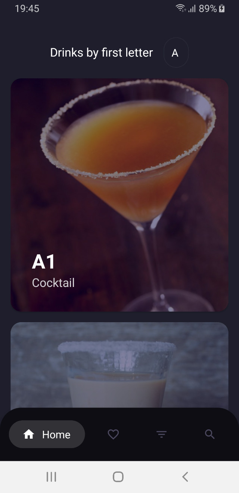
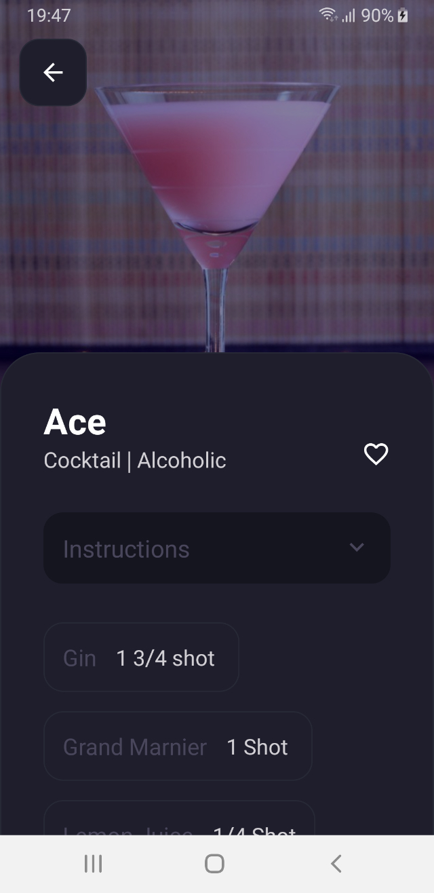
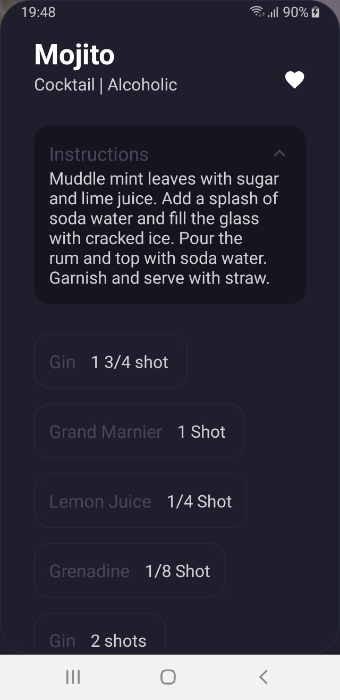
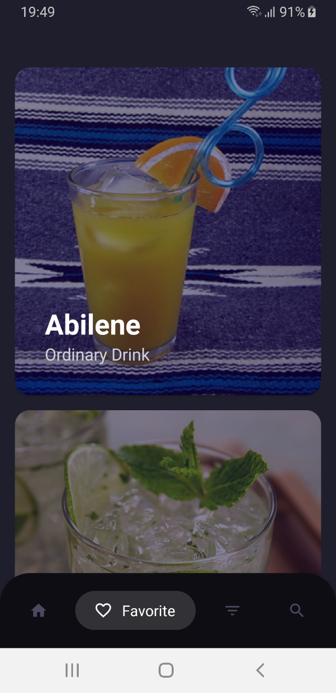
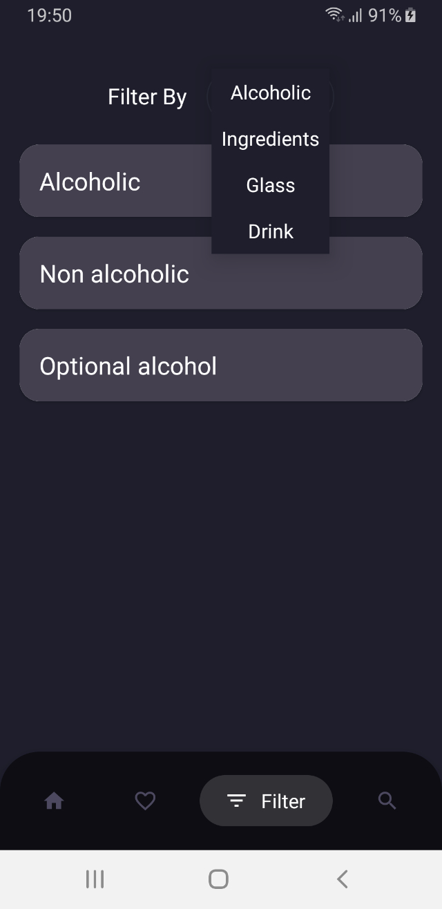
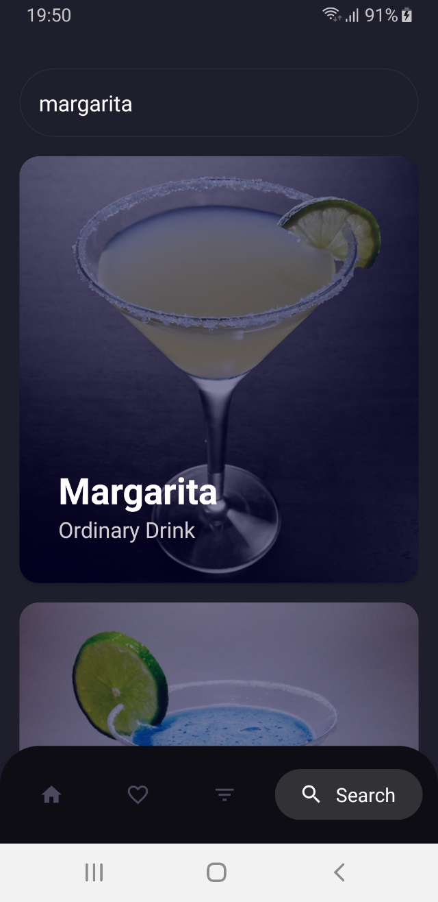

# CocktailBar
### Android application, demonstrating the use of Kotlin's Flow for async development, Room for working with the database and Koin for dependency injection.
The project is using the free api from www.thecocktaildb.com. From the api we are using a few calls to fetch, filter and search drinks. For this we’ll be using Retrofit with OkHttpClient and Moshi converter.

#### **Screenshots**
| | |
| --- | --- |
|  |  |
|  |  |
|  |  |
